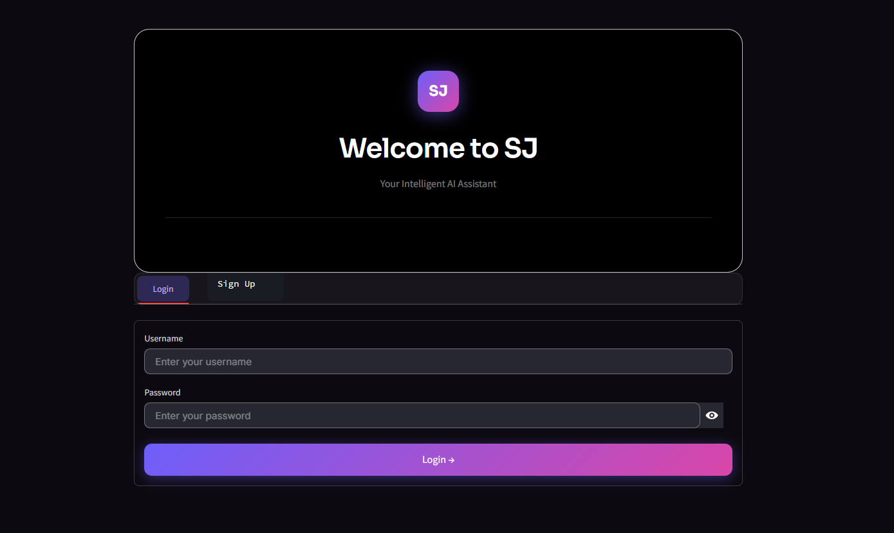
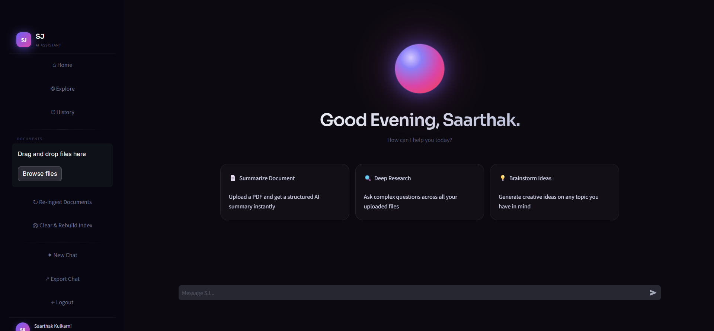
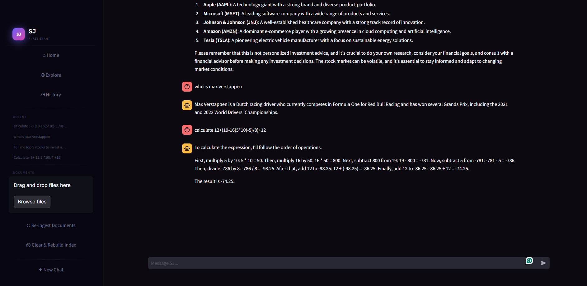
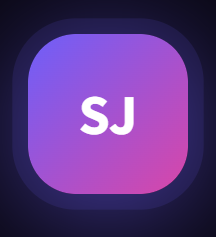

# Production AI Agent

**End-to-End Agentic RAG System with Observability & Deployment**

A production-grade intelligent assistant built using LangGraph, FastAPI, and modern LLM practices.

## ✨ Key Features
- Stateful Agentic workflows (LangGraph)
- Advanced Retrieval Augmented Generation (RAG)
- Tool calling & self-critique
- Full tracing & observability (Langfuse)
- FastAPI backend + Docker ready
- CI/CD pipeline ready

## 🛠 Tech Stack
- Python, FastAPI, LangGraph
- Chroma / FAISS
- Groq / Ollama / Llama-3
- Langfuse, Docker

## Screenshots

### Login Page

### Main Chat Interface

### Logo

